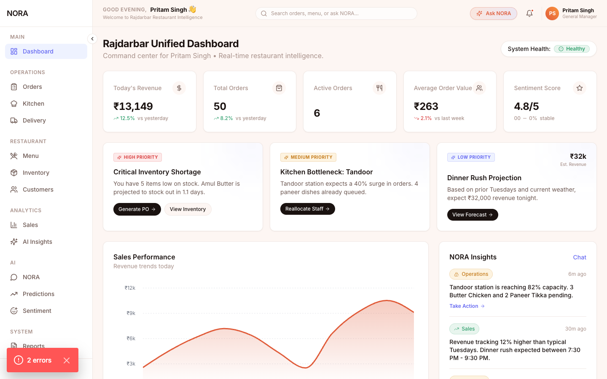
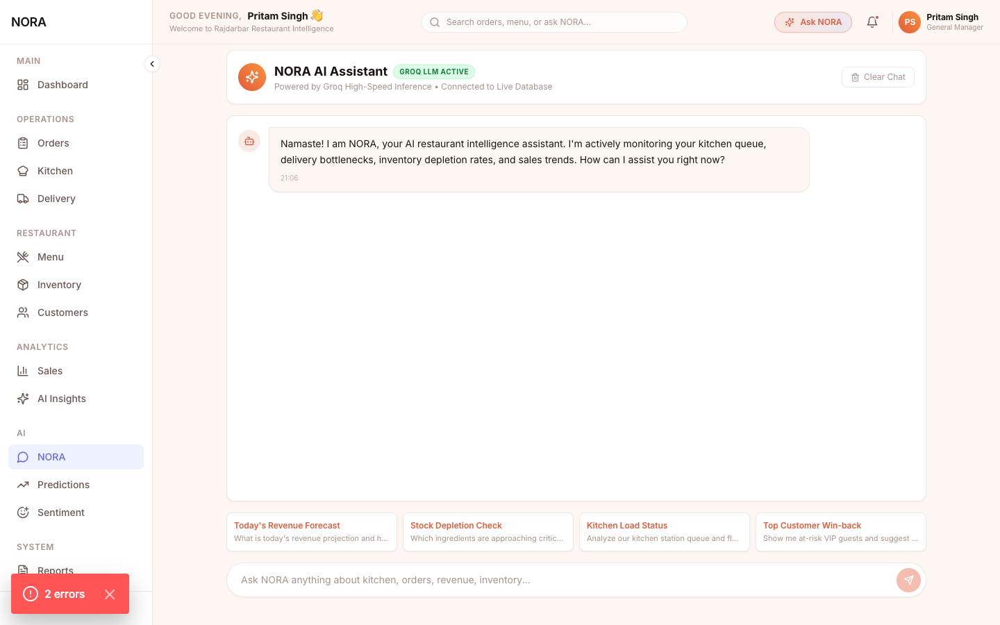
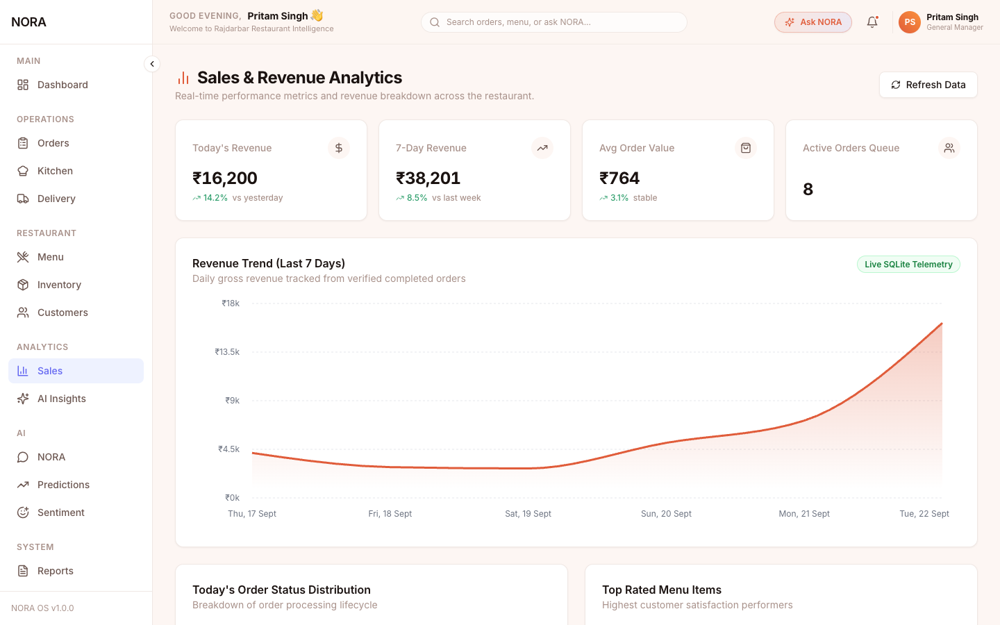

# 🏨 AI-Assisted Smart Hotel & Restaurant Management System


A modern, comprehensive, and AI-powered management dashboard designed for hotels and restaurants. This system leverages the power of generative AI through **N.O.R.A** (Networked Operational Research Assistant) to provide actionable insights, predictive analytics, and sentiment analysis to streamline operations and enhance customer satisfaction.

---

## ✨ Key Features

- **🧠 N.O.R.A. AI Assistant**: Chat with your personalized AI assistant (powered by Groq) for real-time operational advice, menu recommendations, and data-driven decisions.
- **📊 Smart Dashboard**: View real-time KPIs, daily revenue, active orders, and occupancy rates at a glance.
- **📈 Predictive Analytics**: Forecast future sales, ingredient requirements, and inventory needs using historical data and AI models.
- **😊 Sentiment Analysis**: Automatically analyze customer reviews and feedback to gauge overall satisfaction and identify areas for improvement.
- **🍔 Menu & Inventory Management**: Manage your offerings and track stock levels efficiently.
- **🧑‍🍳 Kitchen Display System**: Streamlined view for kitchen staff to manage active orders and preparation times.

---

## 💻 Tech Stack

### Frontend
- **Framework**: [Next.js](https://nextjs.org/) (React)
- **Styling**: [Tailwind CSS](https://tailwindcss.com/)
- **Icons**: Lucide React
- **Language**: TypeScript

### Backend
- **Framework**: [FastAPI](https://fastapi.tiangolo.com/) (Python)
- **Database**: SQLite
- **AI Integration**: [Groq API](https://groq.com/) (Qwen/Llama models)

---

## 📸 Screenshots

### Main Dashboard

*Real-time overview of your restaurant's performance.*

### N.O.R.A AI Assistant

*Get instant operational insights from N.O.R.A.*

### Predictive Analytics

*AI-driven sales forecasts and inventory predictions.*

---

## 🚀 Getting Started

Follow these instructions to get a copy of the project up and running on your local machine.

### Prerequisites
- Node.js (v18 or higher)
- Python (3.8 or higher)
- A [Groq API Key](https://console.groq.com/)

### 1. Clone the Repository
```bash
git clone https://github.com/PreetSingh9234/Ai-Assisted-Smart-Hotel-Restaurant-Management-System.git
cd Ai-Assisted-Smart-Hotel-Restaurant-Management-System
```

### 2. Setup the Backend (FastAPI)
Open a terminal and navigate to the `backend` directory:
```bash
cd backend

# Create a virtual environment
python -m venv venv

# Activate the virtual environment
# On macOS/Linux:
source venv/bin/activate
# On Windows:
# venv\Scripts\activate

# Install dependencies
pip install -r requirements.txt

# Set your Groq API Key
export GROQ_API_KEY="your_groq_api_key_here" 
# On Windows: set GROQ_API_KEY=your_groq_api_key_here

# Start the FastAPI server
uvicorn main:app --reload --port 8000
```
The backend API will be running at `http://localhost:8000`.

### 3. Setup the Frontend (Next.js)
Open a **new** terminal window and navigate to the `frontend` directory:
```bash
cd frontend

# Install dependencies
npm install

# Create a .env.local file and add your API Key
echo 'NEXT_PUBLIC_GROQ_API_KEY="your_groq_api_key_here"' > .env.local

# Start the development server
npm run dev
```
The frontend dashboard will be running at `http://localhost:3000`.

---

## 🤝 Contributing
Contributions, issues, and feature requests are welcome! Feel free to check the issues page.

## 📝 License
This project is licensed under the MIT License.
